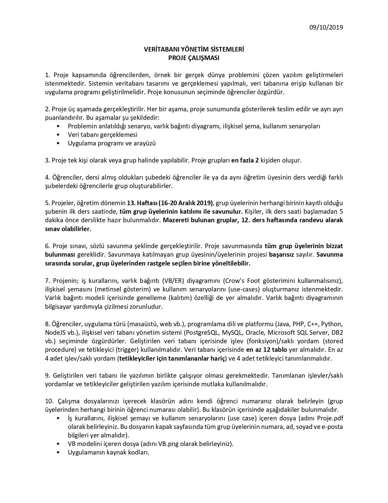
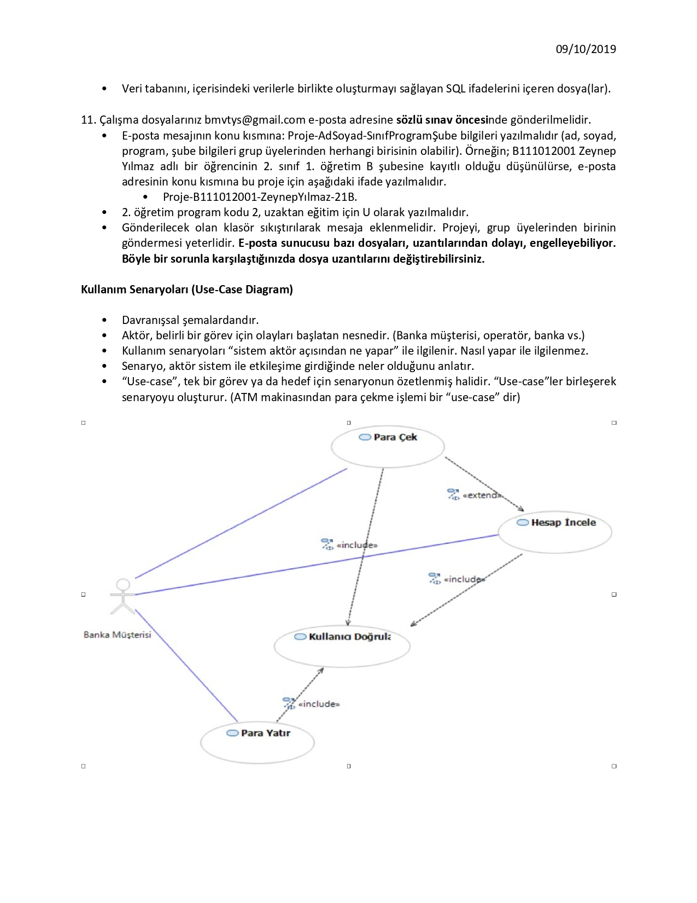

# 2019
# Sale App - Database Management Systems Project

  At assignment, choosing a topic and developing the database and application of that topic.
  
  Making the project with the business rules and entity relationship diagram in database.

### Used Technologies
  
  - C#
  - Microsoft SQL Server

## Homework Document

Sakarya University - Computer Engineering - Database Management Systems Course Homework 3

Berkay Şahin - https://github.com/berkaysahin - https://www.linkedin.com/in/berkaysahin3/ - iletisim@berkaysahin.info

